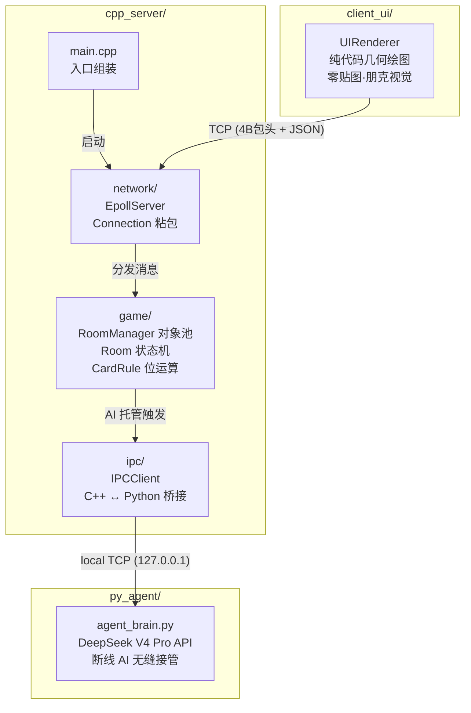

# NexusCore

> 基于 Linux Epoll 的高并发游戏服务端沙盒 ——「五人斗地主」业务验证载体。C++ 强网络/严格逻辑 + Python 大模型具身智能，非对称微服务架构。

[](https://en.cppreference.com/w/cpp/14)
[](./LICENSE)
[](https://cmake.org)

---

## 核心架构



### 网络层 (`network/`)

纯粹的字节流搬运工，严禁耦合任何游戏业务逻辑。

- **Epoll ET + 非阻塞 I/O**：边缘触发模式，单线程事件循环，O(1) 事件分发
- **`Connection` 类**：每个 Socket 维护独立的 `recv_buffer` / `send_buffer`，通过 `ExtractMessage()` 解析 4 字节大端长度头 + JSON Body，根治 TCP 粘包/半包
- **`EpollServer` 类**：管理 `epoll_fd` 和 `unordered_map<int, Connection>`，事件路由只做三件事 —— Accept、Read→Extract→Dispatch、Write

### 游戏逻辑层 (`game/`)

内存对象池与基于位运算的物理规则裁判。

- **`CardRule`**：54 张牌降维为 `uint8_t[0..53]`，`val / 4` 映射逻辑点数。牌型判定（单张/顺子/连对/炸弹/王炸）全部通过位运算和整型比较完成
- **`Room`**：单局 5 人状态机沙盒（WAITING → BIDDING → PLAYING → END），维护 `PlayerContext[5]`、`current_turn`、`last_played_cards`。出牌必须通过 `CardRule::CanBeat()` 物理校验
- **`RoomManager`**：2000 房间对象池，玩家路由，断线 AI 托管触发

### Python AI 网关 (`py_agent/`)

跨进程具身智能 —— 接管掉线玩家的无情发包机器。

- 本地 TCP 连接 C++ 服务器，死循环解析 4 字节包头 + 牌桌快照 JSON
- 提取 `my_hand` 与 `last_played_cards`，构造 Prompt 调用 DeepSeek V4 Pro API
- 铁腕防幻觉兜底：AI 输出经 C++ 引擎 `CardRule` 二次校验，非法出牌自动拦截降级为 Pass

### 客户端 (`client/`)

Windows 原生 EXE，基于 Edge WebView2 内核内嵌 HTML/CSS/JS 渲染。红(#DC2626) / 黑(#000) / 白(#FFF) 撞色朋克风格。卡牌扇形排列+clip-path 倾斜切割，CSS radial-gradient 半调网点背景，纯硬边 box-shadow 印刷错位感，零圆角、零外部贴图。

---

## 目录结构

```
NexusCore/
├── server/                      # [Linux] C++ 高并发后端
│   ├── main.cpp                 # 入口：组装并启动 EpollServer(:8080)
│   ├── CMakeLists.txt           # 构建脚本 (C++14)
│   ├── network/                 # 网络层：Epoll ET · 粘包切割
│   │   ├── EpollServer.h/.cpp
│   │   └── Connection.h/.cpp
│   ├── game/                    # 逻辑层：状态机沙盒 · 规则引擎
│   │   ├── RoomManager.h/.cpp
│   │   ├── Room.h/.cpp
│   │   ├── CardRule.h/.cpp
│   │   └── test_*.cpp           # 446 项规则测试
│   └── ipc/                     # 跨进程通信：C++ ↔ Python 桥接
│       └── IPCClient.h/.cpp
├── server/agent/                # Python AI 托管区
│   ├── agent_brain.py           # 大模型具身决策代理 (stub)
│   ├── stress_test.py           # TCP 并发压力测试脚本
│   └── requirements.txt
├── client/                      # [Windows] C++ 客户端 + WebView2 UI
│   ├── main_client.cpp          # 入口：串联 TcpClient ↔ WebViewHost
│   ├── CMakeLists.txt           # VS2022 + WebView2 SDK 构建
│   ├── network/                 # WinSock2 TCP 层
│   │   └── TcpClient.h/.cpp
│   ├── ui/                      # WebView2 宿主外壳 + JSBridge
│   │   └── WebViewHost.h/.cpp
│   └── html/                    # 前端静态资源
│       └── p5_ui.html           # Void Gazer 风格纯 CSS/JS 界面
└── README.md
```

---

## 性能指标

| 指标 | 目标 | 说明 |
|------|------|------|
| 并发连接 | ≥ 10,000 | Epoll ET 单线程事件循环 |
| 并发房间 | 2,000 | 内存预分配对象池，无运行时堆分配 |
| 空闲 CPU | ≈ 0% | `epoll_wait(-1)` 内核态休眠 |
| 玩家容量 / 房间 | 5 | 2 地主 + 3 农民 |
| AI 决策延迟 | ≤ 3s | DeepSeek API + 本地 TCP 回传 |
| 单房间内存 | < 4KB | `uint8_t` 手牌 + 状态字段，SoA 布局 |

---

## 构建 & 部署

### 环境依赖

| 组件 | 依赖 |
|------|------|
| C++ Server | Linux 2.6.32+ (epoll), g++ 5.0+, CMake 3.10+ |
| Python Agent | Python 3.10+, `openai` |
| Client UI | Windows 10/11, VS2022 Community+, WebView2 Runtime, CMake 3.15+ |

### 编译启动

```bash
# ===== C++ 服务端 (Linux / WSL2) =====
cd server
cmake -B build
cmake --build build
./build/nexus_server

# ===== Python AI 代理 =====
cd server/agent
pip install -r requirements.txt
export DEEPSEEK_API_KEY="sk-xxx"
python3 agent_brain.py

# ===== Windows 客户端 =====
# 前置：安装 WebView2 SDK
nuget install Microsoft.Web.WebView2 -Version 1.0.2903.40 -OutputDirectory client/packages
cd client
cmake -B build -G "Visual Studio 17 2022" -A x64
cmake --build build --config Release
./build/Release/nexus_client.exe

# ===== 端到端测试（Mock Server） =====
cd client
python test_mock_server.py      # 启动模拟服务器
# 另开终端运行客户端，观察 TCP ↔ WebView2 全链路

# ===== 压力测试 =====
cd server/agent
python3 stress_test.py   # 100 并发 TCP 连接
```

---

## 工作日志

### 2026-05-06

- **feat**: CardRule 牌型引擎完整实现与规则对齐
  - 实现 `CanBeat()` 压制判定：王炸 > 炸弹(先比张数4>3，同张比点数) > 普通牌型；顺子比最小点数（同起点更长可压、起点更高须等长/更长，拦短压长）；飞机同K同翅型比主体最小点数；三带一/三带二/四带二/四带两对比主体点数
  - 实现 `SortHand()` 手牌排序：按点数升序、同点数按花色升序（方块<梅花<红桃<黑桃>），王天然排尾
  - 实现 `GetHints()` 提示生成：自由出牌枚举所有合法牌型；桌面有牌时按场景（炸弹/普通/顺子/飞机）搜索可压组合；结果按牌力从小到大排序
  - 新增 `AIRPLANE` 飞机牌型（K≥2 组连续三张，纯/带单翅/带对翅）与 `QUAD_TWO_PAIRS` 四带两对牌型（4+2对=8张）
  - 修正顺子/连对不含 2 和王（搜索范围 0~11），对齐规则文档
  - 修正 `CanBeat` 使用 `BodyRank()` 提取主体点数，避免复合牌型（三带一/四带二）kicker 干扰比较

- **test**: 牌型规则全覆盖测试（446 项全部通过）
  - `test_cardrule.cpp` — 手工精确测试 + 10,000 回合随机牌局模拟（3 玩家轮流出牌互压）
  - `test_comprehensive.cpp` — 175 项全覆盖：识别/BodyRank/压制链/顺子边界/连对边界/飞机边界/跨级压制/非法牌型/GetHints/SortHand
  - `test_types.cpp` — 63 项分类型专项：顺子(拦短压长)/飞机(同翅互压/不同翅不互压)/三带一/三带二/四带二/四带两对

- **fix**: 网络层 & IPC 五处致命漏洞修复（Gemini 审计 + 自查）
  - [#1 IPC 乱序] `IPCClient::SendSnapshot` — `send_buffer` 非空时新数据直接 `send()` 插队导致 TCP 字节流乱序。修复为检查队列非空时 `append` 到队尾
  - [#2 4GB 核弹] `ExtractMessage` / `ExtractAIDecision` — `body_length` 无上限校验，恶意包头 `0xFFFFFFFF` 可致 OOM。修复为加入 `MAX_PACKET_SIZE=64KB` 强校验，超标标记 `bad_packet` 踢连接
  - [#3 ET 部分发送] `WriteToSocket` / `FlushSendBuffer` — ET 模式下 `send()` 只调一次，部分发送后若 socket 仍可写则永不触发新 `EPOLLOUT`，残留数据永久滞留。修复为 `while(!empty)` 循环 `send()` 至 `EAGAIN`
  - [#4 Epoll 鞭尸] `Loop()` — `HandleRead` 断开连接 `close(fd)` 后无保护继续执行 `HandleWrite(fd)`。修复为 `HandleRead` 返回 `bool`，断线回 `false` 时 `continue` 跳过写路径
  - [#5 事件/注册] 新增 `EPOLLHUP|EPOLLERR` 显式处理；`HandleAccept` 中 `epoll_ctl` 返回值检查防 fd 泄漏；IPC 路径 `bad_packet` 检测

### 2026-05-04

- **chore**: 重构项目目录结构，严格对齐技术文档物理布局
  - 删除旧版 `GameWorld.h/.cpp`，`main.cpp` 清空为入口桩
  - `EpollServer` 剥离 `GameWorld` 依赖，`Loop()` 预留 EPOLLIN 空壳分支
  - 网络层 / 游戏逻辑层 / IPC 通信层骨架全部就位（`network/`, `game/`, `ipc/` 共 8 组 `.h/.cpp`）
  - 新建 `client_ui/` 渲染引擎目录及骨架文件（`main_client.cpp`, `UIRenderer`, `CMakeLists.txt`）
  - 构建系统切换至 CMake (C++14)，输出 `nexus_server`
  - `.gitignore` 完善：排除构建产物、IDE 配置、内部设计文档

- **feat**: 实现网络层与 IPC 通信层完整功能
  - `Connection` — `ReadFromSocket()` 死循环 recv 至 EAGAIN，`ExtractMessage()` 4 字节大端包头粘包切割，`WriteToSocket()` 从 send_buffer 刷出
  - `IPCClient` — `ConnectToAI()` 主动连接 Python 进程，`SendSnapshot()` 打包 [4B包头+JSON] 非阻塞发送，`ReadFromSocket()` 收包，`ExtractAIDecision()` 切完整帧
  - `EpollServer` — `HandleAccept()` ET 循环 accept，`HandleRead()`/`HandleWrite()` 按 fd 路由分发至 Connection 或 IPCClient
  - `main.cpp` 组装 EpollServer 并启动事件循环

- **fix**: 修复网络层两处数据丢失隐患
  - `IPCClient::SendSnapshot()` — `send()` 返回 EAGAIN 时原逻辑直接 return false 丢弃整包，修复为完整暂存 `send_buffer` 等 EPOLLOUT 续发
  - `EpollServer::Loop()` — 玩家 fd 的 EPOLLIN/EPOLLOUT 使用 else-if 链，同事件双标志置位时 EPOLLOUT 被跳过，修复为独立 if 分支
  - 清理 `HandleWrite()` 不可达 IPC 死代码，更新 `Connection.h` 过期注释

- **docs**: 编写项目 README，覆盖核心架构、目录结构、性能指标、构建部署与工作日志

### 2026-05-03

- **feat**: 项目初始化 —— C++ 游戏服务端核心与 Python Agent IPC 通信底座
  - 实现基于 Epoll ET 的 TCP 高并发服务器 (`EpollServer`)，支持 `SO_REUSEADDR` 秒级重启
  - 实现 `GameWorld` 玩家状态管理（WASD 移动坐标）
  - 建立 `py_agent/` Python 代理目录，含 100 线程并发压力测试脚本 (`stress_test.py`)
  - 预留 `IPCClient` C++↔Python 跨进程通信接口桩

---

## 待办事项 (TODO)

### 客户端 (`client/`)

| # | 事项 | 优先级 | 说明 |
|---|------|:------:|------|
| 1 | **主界面 / 大厅** | 高 | 目前只有游戏内 UI (`p5_ui.html`)，缺少大厅界面：房间列表、创建/加入房间、玩家昵称设置。需要新增 `lobby.html` 或在 `p5_ui.html` 中增加大厅阶段 |
| 2 | **心跳机制** | 高 | 客户端目前不发送心跳包。PRD 要求心跳丢失 5s 触发断线接管，需实现定时 Ping/Pong，服务端侧配合超时检测 |
| 3 | **命令行参数** | 中 | 服务器 IP/端口硬编码在 `main_client.cpp`。应支持 `--server <ip> --port <port>` 参数解析 |
| 4 | **断线重连** | 中 | `TcpClient` 断开后无自动重连逻辑，需实现指数退避重连 + 恢复游戏状态 |
| 5 | **非阻塞 Socket** | 低 | 技术文档要求非阻塞 Socket 或 IOCP，当前用阻塞 `recv` + 独立线程。功能正确但不符合文档规定 |
| 6 | **客户端测试** | 低 | `TcpClient` 和 `WebViewHost` 无单元测试，仅有 `test_mock_server.py` 端到端手动测试 |
| 7 | **HTML 响应式适配** | 低 | `p5_ui.html` body 硬编码 1600×900px，无法自适应不同分辨率窗口 |

### 服务端 (`server/`)

| # | 事项 | 优先级 | 说明 |
|---|------|:------:|------|
| 8 | **AI 大脑实现** | 高 | `agent/agent_brain.py` 为空桩，需接入 DeepSeek API 实现具身决策 |
| 9 | **BroadcastState 实现** | 高 | `Room::BroadcastState()` 和 `SerializeState()` 为骨架注释，需填充完整 JSON 序列化与广播逻辑 |
| 10 | **完整出牌流程** | 高 | `Room::HandleBidding()` / `HandlePlaying()` 逻辑为伪代码注释，需实现 CALL/PASS 叫地主 + PLAY/PASS 出牌 |

---

## 设计准则

- **零拷贝**：网络层直接搬运字节流，不触及游戏业务数据
- **无锁沙盒**：房间物理隔离，单房间内串行处理，无锁竞争
- **AI 仅建议权**：Python 进程出建议，C++ 引擎拥有最终裁判权 —— `CardRule` 铁腕校验不可绕过
- **可观测**：关键路径全部落 stdout，不猜、不蒙、可追溯。后续接入 spdlog 分级输出

## License

MIT
