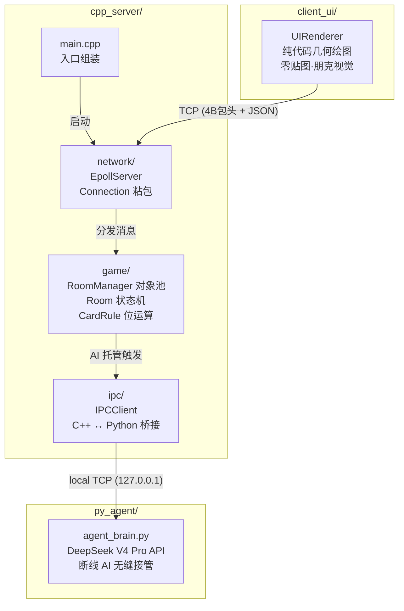

# NexusCore

> 基于 Linux Epoll 的高并发游戏服务端沙盒 ——「五人斗地主」业务验证载体。C++ 强网络/严格逻辑 + Python 大模型具身智能，非对称微服务架构。

[](https://en.cppreference.com/w/cpp/14)
[](./LICENSE)
[](https://cmake.org)

---

## 核心架构



### 网络层 (`network/`)

纯粹的字节流搬运工，严禁耦合任何游戏业务逻辑。

- **Epoll ET + 非阻塞 I/O**：边缘触发模式，单线程事件循环，O(1) 事件分发
- **`Connection` 类**：每个 Socket 维护独立的 `recv_buffer` / `send_buffer`，通过 `ExtractMessage()` 解析 4 字节大端长度头 + JSON Body，根治 TCP 粘包/半包
- **`EpollServer` 类**：管理 `epoll_fd` 和 `unordered_map<int, Connection>`，事件路由只做三件事 —— Accept、Read→Extract→Dispatch、Write

### 游戏逻辑层 (`game/`)

内存对象池与基于位运算的物理规则裁判。

- **`CardRule`**：54 张牌降维为 `uint8_t[0..53]`，`val / 4` 映射逻辑点数。牌型判定（单张/顺子/连对/炸弹/王炸）全部通过位运算和整型比较完成
- **`Room`**：单局 5 人状态机沙盒（WAITING → BIDDING → PLAYING → END），维护 `PlayerContext[5]`、`current_turn`、`last_played_cards`。出牌必须通过 `CardRule::CanBeat()` 物理校验
- **`RoomManager`**：2000 房间对象池，玩家路由，断线 AI 托管触发

### Python AI 网关 (`py_agent/`)

跨进程具身智能 —— 接管掉线玩家的无情发包机器。

- 本地 TCP 连接 C++ 服务器，死循环解析 4 字节包头 + 牌桌快照 JSON
- 提取 `my_hand` 与 `last_played_cards`，构造 Prompt 调用 DeepSeek V4 Pro API
- 铁腕防幻觉兜底：AI 输出经 C++ 引擎 `CardRule` 二次校验，非法出牌自动拦截降级为 Pass

### 客户端 (`client_ui/`)

基于 Raylib 底层几何绘图 API，零贴图、纯代码实时渲染。红(#FF004D) / 黑(#1A1A1A) / 白(#F2F2F2) 撞色朋克风格。卡牌以倾斜平行四边形呈现，交互反馈靠颜色反转与坐标锐角偏移。

---

## 目录结构

```
NexusCore/
├── cpp_server/                  # C++ 物理底座
│   ├── main.cpp                 # 入口：组装并启动 EpollServer
│   ├── CMakeLists.txt           # 构建脚本 (C++14, 递归编译子目录)
│   ├── network/                 # 网络层：Epoll 调度 · 粘包切割
│   │   ├── EpollServer.h/.cpp
│   │   └── Connection.h/.cpp
│   ├── game/                    # 逻辑层：状态机沙盒 · 规则引擎
│   │   ├── RoomManager.h/.cpp
│   │   ├── Room.h/.cpp
│   │   └── CardRule.h/.cpp
│   └── ipc/                     # 跨进程通信：C++ ↔ Python 桥接
│       └── IPCClient.h/.cpp
├── py_agent/                    # Python AI 托管区
│   ├── agent_brain.py           # 大模型具身决策代理
│   ├── stress_test.py           # TCP 并发压力测试脚本
│   └── requirements.txt
├── client_ui/                   # 前端渲染引擎
│   ├── main_client.cpp          # 客户端主循环与网络连接
│   ├── UIRenderer.h/.cpp        # 纯代码几何绘图 (零贴图)
│   └── CMakeLists.txt           # 构建脚本 (链接 raylib)
└── README.md
```

---

## 性能指标

| 指标 | 目标 | 说明 |
|------|------|------|
| 并发连接 | ≥ 10,000 | Epoll ET 单线程事件循环 |
| 并发房间 | 2,000 | 内存预分配对象池，无运行时堆分配 |
| 空闲 CPU | ≈ 0% | `epoll_wait(-1)` 内核态休眠 |
| 玩家容量 / 房间 | 5 | 2 地主 + 3 农民 |
| AI 决策延迟 | ≤ 3s | DeepSeek API + 本地 TCP 回传 |
| 单房间内存 | < 4KB | `uint8_t` 手牌 + 状态字段，SoA 布局 |

---

## 构建 & 部署

### 环境依赖

| 组件 | 依赖 |
|------|------|
| C++ Server | Linux 2.6.32+ (epoll), g++ 5.0+, CMake 3.10+ |
| Python Agent | Python 3.10+, `openai` |
| Client UI | Raylib 4.0+, CMake 3.10+ |

### 编译启动

```bash
# ===== C++ 服务端 =====
cd cpp_server
cmake -B build
cmake --build build
./build/nexus_server

# ===== Python AI 代理 =====
cd py_agent
pip install -r requirements.txt
export DEEPSEEK_API_KEY="sk-xxx"
python3 agent_brain.py

# ===== 客户端 (开发中) =====
cd client_ui
cmake -B build
cmake --build build
./build/nexus_client

# ===== 压力测试 =====
cd py_agent
python3 stress_test.py   # 100 并发 TCP 连接
```

---

## 工作日志

### 2026-05-04

- **chore**: 重构项目目录结构，严格对齐技术文档物理布局
  - 删除旧版 `GameWorld.h/.cpp`，`main.cpp` 清空为入口桩
  - `EpollServer` 剥离 `GameWorld` 依赖，`Loop()` 预留 EPOLLIN 空壳分支
  - 网络层 / 游戏逻辑层 / IPC 通信层骨架全部就位（`network/`, `game/`, `ipc/` 共 8 组 `.h/.cpp`）
  - 新建 `client_ui/` 渲染引擎目录及骨架文件（`main_client.cpp`, `UIRenderer`, `CMakeLists.txt`）
  - 构建系统切换至 CMake (C++14)，输出 `nexus_server`
  - `.gitignore` 完善：排除构建产物、IDE 配置、内部设计文档

- **feat**: 实现网络层与 IPC 通信层完整功能
  - `Connection` — `ReadFromSocket()` 死循环 recv 至 EAGAIN，`ExtractMessage()` 4 字节大端包头粘包切割，`WriteToSocket()` 从 send_buffer 刷出
  - `IPCClient` — `ConnectToAI()` 主动连接 Python 进程，`SendSnapshot()` 打包 [4B包头+JSON] 非阻塞发送，`ReadFromSocket()` 收包，`ExtractAIDecision()` 切完整帧
  - `EpollServer` — `HandleAccept()` ET 循环 accept，`HandleRead()`/`HandleWrite()` 按 fd 路由分发至 Connection 或 IPCClient
  - `main.cpp` 组装 EpollServer 并启动事件循环

- **fix**: 修复网络层两处数据丢失隐患
  - `IPCClient::SendSnapshot()` — `send()` 返回 EAGAIN 时原逻辑直接 return false 丢弃整包，修复为完整暂存 `send_buffer` 等 EPOLLOUT 续发
  - `EpollServer::Loop()` — 玩家 fd 的 EPOLLIN/EPOLLOUT 使用 else-if 链，同事件双标志置位时 EPOLLOUT 被跳过，修复为独立 if 分支
  - 清理 `HandleWrite()` 不可达 IPC 死代码，更新 `Connection.h` 过期注释

- **docs**: 编写项目 README，覆盖核心架构、目录结构、性能指标、构建部署与工作日志

### 2026-05-03

- **feat**: 项目初始化 —— C++ 游戏服务端核心与 Python Agent IPC 通信底座
  - 实现基于 Epoll ET 的 TCP 高并发服务器 (`EpollServer`)，支持 `SO_REUSEADDR` 秒级重启
  - 实现 `GameWorld` 玩家状态管理（WASD 移动坐标）
  - 建立 `py_agent/` Python 代理目录，含 100 线程并发压力测试脚本 (`stress_test.py`)
  - 预留 `IPCClient` C++↔Python 跨进程通信接口桩

---

## 设计准则

- **零拷贝**：网络层直接搬运字节流，不触及游戏业务数据
- **无锁沙盒**：房间物理隔离，单房间内串行处理，无锁竞争
- **AI 仅建议权**：Python 进程出建议，C++ 引擎拥有最终裁判权 —— `CardRule` 铁腕校验不可绕过
- **可观测**：关键路径全部落 stdout，不猜、不蒙、可追溯。后续接入 spdlog 分级输出

## License

MIT
