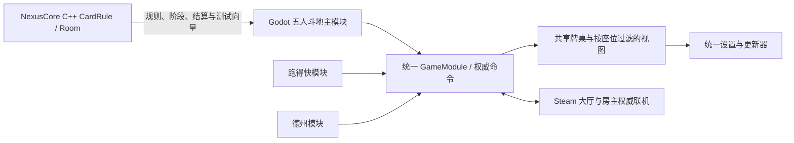

# NexusCore → OneStepCards：从网络原型到多玩法应用

NexusCore 是 C++ 网络与牌局规则的实践原型。后续的 **OneStepCards（一步牌局）** 使用 Godot 构建桌面纸牌应用，将其中的五人斗地主规则、状态流转和测试向量迁移进统一游戏容器，与跑得快、德州共用大厅、牌桌、设置和更新器。

两者属于同一段个人实践的不同阶段：本仓库公开 C++ 阶段代码，本页补充后续规则复用与产品集成过程。

## 两个阶段解决什么问题

| 阶段 | 问题 | 实现方式 |
| --- | --- | --- |
| NexusCore：网络与业务原型 | TCP 没有消息边界，网络连接和牌局规则容易混在一起 | 非阻塞 epoll、长度前缀分帧、收发缓冲，独立房间状态机与规则层 |
| NexusCore：托管探索 | 外部模型给出的行动可能不合法或无法解析 | Python 提出候选行动，C++ 规则层校验，提供失败兜底；定位为 LLM 接入原型 |
| OneStepCards：规则迁移 | 更换引擎后仍需保持原牌型比较、叫牌、出牌与结算语义 | 将 `CardRule / Room` 的规则和状态行为重写为强类型 GDScript，使用来源测试向量与固定回放核对 |
| OneStepCards：多玩法集成 | 每增加一种玩法就复制大厅、UI、网络和设置会难以维护 | `GameModule` 统一配置、权威命令与视图投影；跑得快、五人斗地主、德州复用同一牌桌和应用外壳 |
| OneStepCards：朋友联机与交付 | 单机和联机容易出现两套规则；更新需要手工替换文件 | 本地与房主复用权威规则，按座位过滤快照；接入 Steam Lobby / P2P、版本检查、签名清单与更新回滚 |

## 保留的业务，改变的基础设施

- **规则来源**：五人、一副 54 张牌、两地主对三农民、叫地主、选底牌、行动顺序、清台、特殊牌型比较、倍率与结算。
- **权威分工**：NexusCore 由 Linux 服务端持有牌局；OneStepCards 由本地或联机房主持有唯一权威状态，UI、机器人与远端玩家均提交命令。
- **迁移范围**：复用规则和行为，WebView2 界面改为 Godot Control。原 epoll 服务、WinSock / WebView2 外壳和 Python LLM 代理不属于 Godot 运行依赖。
- **机器人实现**：OneStepCards 使用本地策略并遵循该座位可见的信息，不能将它描述为已完成的 LLM 对战产品。

## 验证记录与版本范围

2026-09-16 根据项目的迁移合同、实际模块及测试代码、2026-09-05 发布记录核对本页内容。alpha.11 阶段记录包含三种玩法的规则检查、独立进程联机状态一致性、真实 Steam 大厅创建与清理，以及旧启动器升级、回滚保留和再次启动检查。这里引用已有记录，本次只补充文档。

独立进程和本机 Steam 检查有助于核对协议与状态；跨地域、多真实账号的网络体验仍需单独验证。后续本地交互改进与已发布版本分开记录。NexusCore 的万级连接等容量数字仍是设计目标。

核对依据包括迁移合同 `28_MULTI_GAME_CONTAINER_AND_NEXUSCORE.md`、`FivePlayerLandlordsModule`、`five_landlords_rule_test_suite.gd` 和发布记录 `E-043`；这些是 OneStepCards 开发资料名称，不是本仓库内的文件链接。

## 从公开代码继续阅读

- [CardRule.cpp](../server/game/CardRule.cpp)：原始牌型识别与比较。
- [Room.cpp](../server/game/Room.cpp)：原始牌局阶段、动作和广播处理。
- [网络层](../server/network)：C++ 网络实践入口。
- [项目导读](PROJECT_GUIDE.md)：NexusCore 运行路线与验证记录。

[返回 NexusCore 首页](../README.md) · [个人项目总览](https://github.com/IceaXo)
